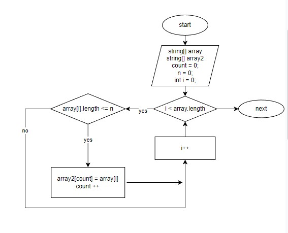

# Задача.

Написать программу, которая из имеющегося массива строк формирует массив из строк, длина которых меньше либо равна 3 символа. Первоначальный массив можно ввести с клавиатуры, либо задать на старте выполнения алгоритма. При решении не рекомендуется пользоваться коллекциями, лучше обойтись исключительно массивами.

# Описание

- string[] array = { "hello", "world", "i", "am", "Roman", "Makulin", "1998", ":-)" }; 

Задаем исходный массив строк.

- string[] array2 = new string[array.Length];

Задаем второй массив, куда будем записывать (присваиваить) строки, в нашем случае слова, удовлетворяющие условиям задачи (меньше либо равно 3 символам).

- int n = 3;

Задаем значение требуемого условия (меньше либо равно 3 символам).


```
void StringWithNElements(string[] array, string[] array2)
{
    int count = 0;
    for (int i = 0; i < array.Length; i++)
    {
        if (array[i].Length <= n)
        {
            array2[count] = array[i];
            count++;
        }
    }
}

Пишем первый метод типа void, который принимает на вход первый и второй массив.
Вводим дополнительный счетчик count для второго массива. Альтернатива - счетчик "i" для первого массива.
Используем цикл for для перебора каждого элемента (подстроки) по длине (перебираем первый массив).
Делаем проверку, подходящую под условие задачи (с помощью if). 
Если проверка проходит, то записываем элемент во второй массив и преключаем счетчик.
```
```
void PrintArray(string[] array)
{
    for (int i = 0; i < array.Length; i++) System.Console.Write($"{array[i]} ");
}
Создаем отдельный метод типа void, который принимает на вход один единственный второй массив, с уже записанными значениями.
Выводим на печать каждое значение используя цикл for.
```

``` 
- StringWithNElements(array, array2); - Вызываем первый метод.
- PrintArray(array2); - Вызываем второй метод.

  Клиентский код.
 ```

 !!! Добавлена блок схема 
 
 